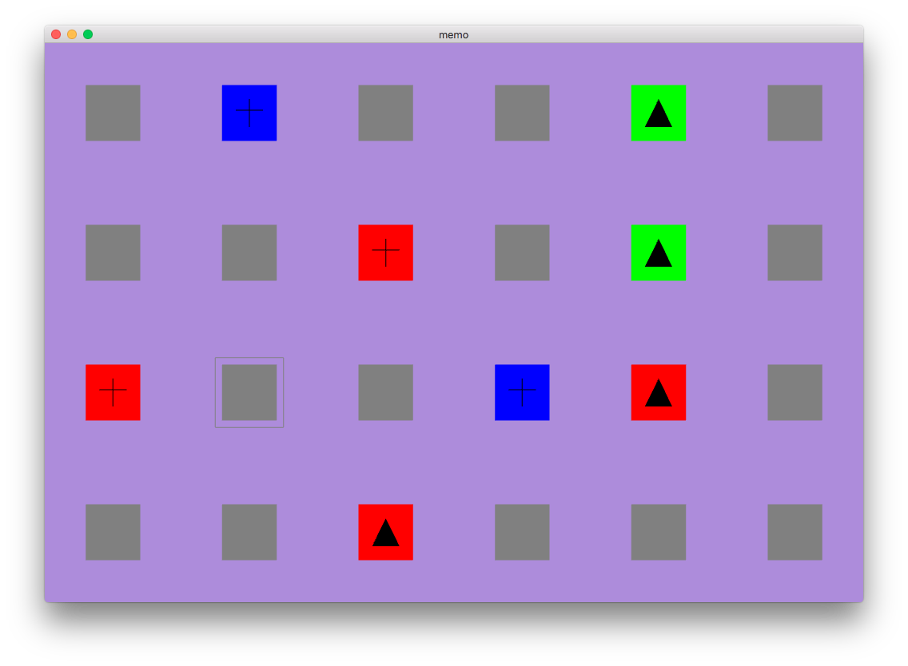
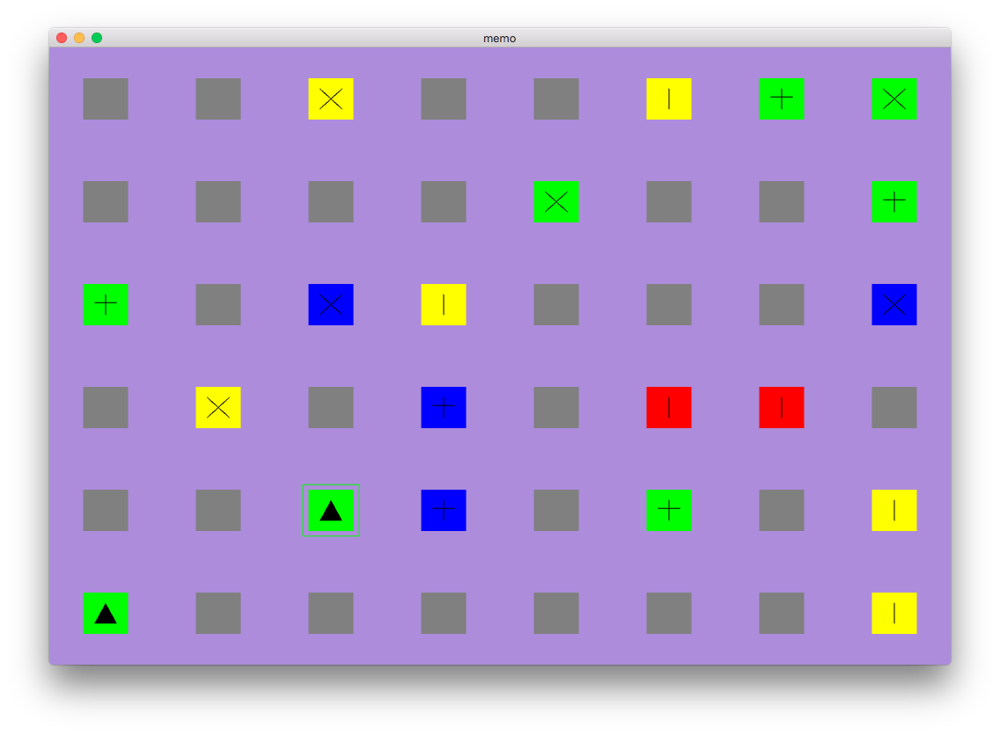

# MEMO Game (OpenGL)

### Example
#### default settings ./memo or ./memo 6 4 3 3

#### ./memo 8 6 4 4


### Build
```bash
# linux-like:
$ make linux
# for macos:
$ make mac
# clean binaries
$ make clean
```

### Run
```
# will print help message
$ ./memo help
MEMO game
Podstawy Grafiki Komputerowej 2016
author: kstarzyk 264734

  Build:   $ make linux OR $ make mac (default: make mac)
  Usage:   $ ./memo M N K W (default values: 6 4 3 3)
  Example: $ ./memo 8 4 3 (M=8, N=4, K=3, W=3(default))


# start game for 24 cards in one of 2 colors and one of 4 shapes
$ ./memo 6 4 2 4
# will fail because K*W > 2*M*N
$ ./memo 4 4 4 4
```
### Overwiev

- 6 Colors
- 4 Shapes (Line, Cross, Triangle, X)

### Implementation details
Most constants and VBO are defined in card.hpp.

*GLM* library is used.

